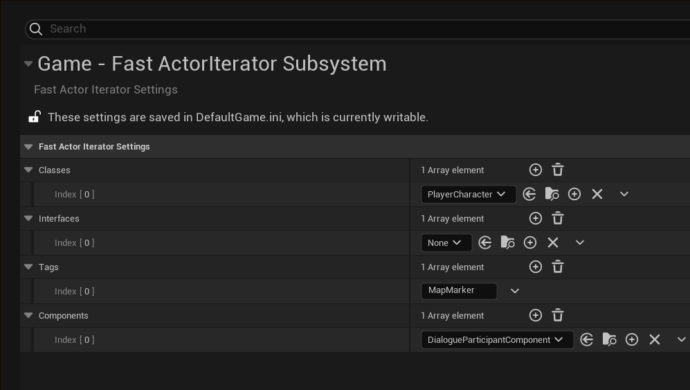
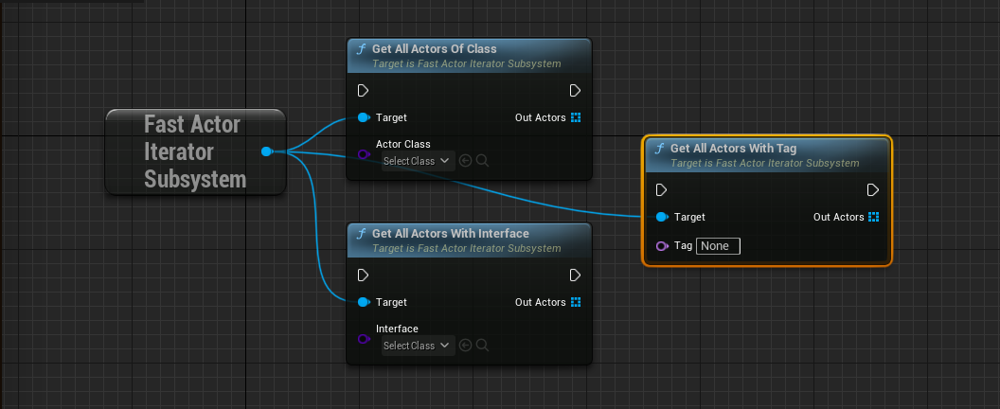

# FastActorIterator
# What is it?
**FastActorIterator** is a plugin for Unreal Engine which allow to fast iterate over certain actors in level with large number of actors.

# Features
* Same syntax as GameplayStatics functions: GetAllActorsOfClass/GetAllActorsWithInterface/GetAllActorsWithTag
* Fully written in C++
* Supports fallback to default GameplayStatics GetAllActors implementations if you forgot to configure settings

# Table of content:
 - [How it is work?](#how-it-is-work)
 - [Settings](#settings)
 - [Usage](#usage)
 - [FAQ](#faq)

# How it is work?
Sometimes you want to iterate over actors of certain type for some purposes. If you have large actor count it can cause notable spike/fps drop. To avoid this usually you manage separate list per type for faster access. FastActorIteratorSubsystem does it for you. Specify actor type in project settings and use functions with same signature as GameplayStatics provides.

# Settings
Specify actor with desired class/interface/tag/component in project settings, otherwise default GameplayStatics slow implementation will be used



# Usage
## Blueprint Project
1. Install the plugin through the official epic games launcher.
2. Configure Fast ActorIterator Subsystem section of [Project Settings](#settings))
3. Use functions from FastActorIteratorSubsystem


## CPP Project
1. Add FastActorIterator to your project plugins folder
2. Enable plugin in project file and add FastActorIterator to your game dependency modules (inside YOUR_GAME.Build.cs file)
3. Include “FastActorIteratorSubsystem.h”
4. Use either GameplayStatics like syntax functions from UFastActorIteratorSubsystem
```cpp
static void GetAllActorsWithInterface(const UObject* WorldContextObject, TSubclassOf<UInterface> Interface, TArray<AActor*>& OutActors);
static void GetAllActorsOfClass(const UObject* WorldContextObject, TSubclassOf<AActor> ActorClass, TArray<AActor*>& OutActors);
static void GetAllActorsWithTag(const UObject* WorldContextObject, FName Tag, TArray<AActor*>& OutActors);
static void GetAllActorsWithComponent(const UObject* WorldContextObject, TSubclassOf<UActorComponent> ComponentClass, TArray<AActor*>& OutActors);
```
either templated variant
```cpp
template<class T>
static void GetAllActorsOfClass(const UObject* WorldContextObject, TArray<T*>& OutActors)
```

# FAQ
Q: **Does dynamically added components or tags supported?**

A: No.

Q: **What platforms are supported?**

A: Win32, Win64, Mac, Linux. Potentially it should work on any platform.